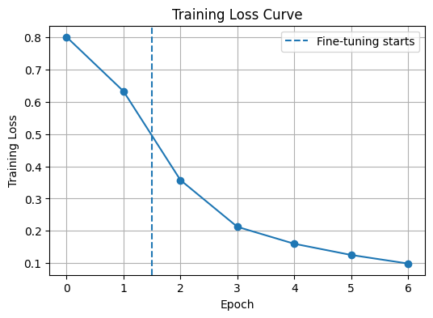
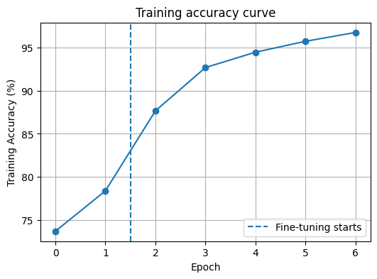

# CIFAR-10 Classification with Transfer Learning using ResNet18

**Test Accuracy: 94.85%**

Using a pretrained ResNet18 model for Transfer learning on the CIFAR-10 dataset on pytorch.

The model is trained in two steps:

1. Training only the final classification layer.
2. fine tuning the entire network.

The project is contained in a single Jupyter notebook for google colab compatibility.

---
## Google Colab

Run the notebook directly in Colab:

[](https://colab.research.google.com/drive/1ED9iU7te_PZYcPe4ChABRTyGThkEk8z8?usp=sharing)

---

## Project Structure

```
CIFAR10-ResNet18/

├── CIFAR10-ResNet18.ipynb
├── README.md
├── requirements.txt
│
└── images/
    ├── loss_curve.png
    └── accuracy_curve.png
```

---
## Dataset

CIFAR-10 dataset is used, containing 60,000 RGB images of size 32×32 across 10 classes:

* Airplane
* Automobile
* Bird
* Cat
* Deer
* Dog
* Frog
* Horse
* Ship
* Truck

The dataset is downloaded using `torchvision.datasets.CIFAR10` automatically in the notebook.

---
## Training Strategy

The model is trained in two steps:

### Stage 1

Train only the final classification layer while all pretrained ResNet18 layers remain frozen.

### Stage 2

The entire network is unfrozen and fine tuned using small learning rate and weight decay.

---
## Results

Final Test Accuracy:

**94.85%**

### Graphs:

#### Training Loss Curve


#### Training Accuracy Curve


The dashed line in the graphs shows transition from classifier training to fine tuning.

### Final trained model

A trained model can be download from [model link](https://drive.google.com/file/d/1FuEY71BqcyHWNAxCGm2nSzNPSP39Bvix/view?usp=sharing)

---
## Installation

Install the required packages:

```bash
pip install -r requirements.txt
```

**or**

```bash
pip install torch torchvision matplotlib
```
---
## Running the Project

Open:

```
CIFAR10-ResNet18.ipynb
```

Or Run the notebook directly in Google Colab:

[](https://colab.research.google.com/drive/1ED9iU7te_PZYcPe4ChABRTyGThkEk8z8?usp=sharing)

and run all cells.

The notebook downloads the CIFAR-10 dataset and trains the model.